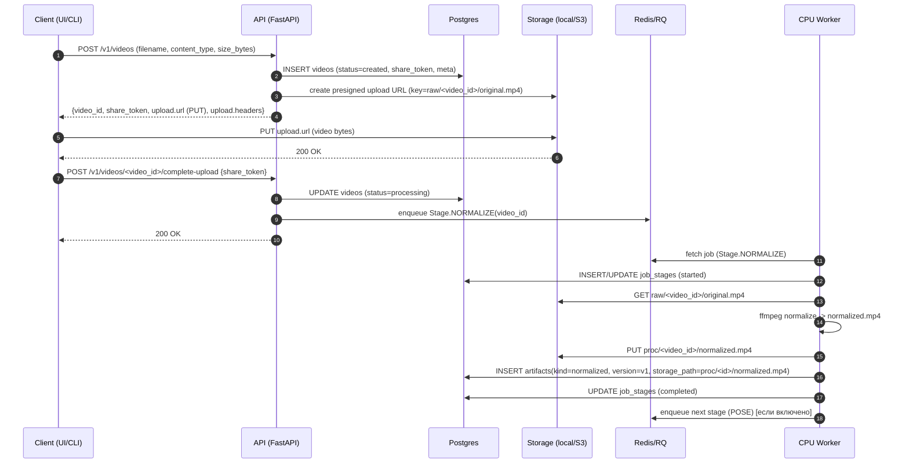

# Backend

Коротко: backend принимает метаданные о видео, выдает presigned URL для загрузки,
запускает обработку через очередь и сохраняет артефакты в storage.

## Схема взаимодействия

```mermaid
sequenceDiagram
  autonumber
  participant UI as Client (UI/CLI)
  participant API as API (FastAPI)
  participant DB as Postgres
  participant ST as Storage (local/S3)
  participant RQ as Redis/RQ
  participant W as CPU Worker

  UI->>API: POST /v1/videos (filename, content_type, size_bytes)
  API->>DB: INSERT videos (status=created, share_token, meta)
  API->>ST: create presigned upload URL (key=raw/<video_id>/original.mp4)
  API-->>UI: {video_id, share_token, upload.url (PUT), upload.headers}

  UI->>ST: PUT upload.url (video bytes)
  ST-->>UI: 200 OK

  UI->>API: POST /v1/videos/<video_id>/complete-upload {share_token}
  API->>DB: UPDATE videos (status=processing)
  API->>RQ: enqueue Stage.NORMALIZE(video_id)
  API-->>UI: 200 OK

  W->>RQ: fetch job (Stage.NORMALIZE)
  W->>DB: INSERT/UPDATE job_stages (started)
  W->>ST: GET raw/<video_id>/original.mp4
  W->>W: ffmpeg normalize -> normalized.mp4
  W->>ST: PUT proc/<video_id>/normalized.mp4
  W->>DB: INSERT artifacts(kind=normalized, version=v1, storage_path=proc/<id>/normalized.mp4)
  W->>DB: UPDATE job_stages (completed)
  W->>RQ: enqueue next stage (POSE) [если включено]
```
