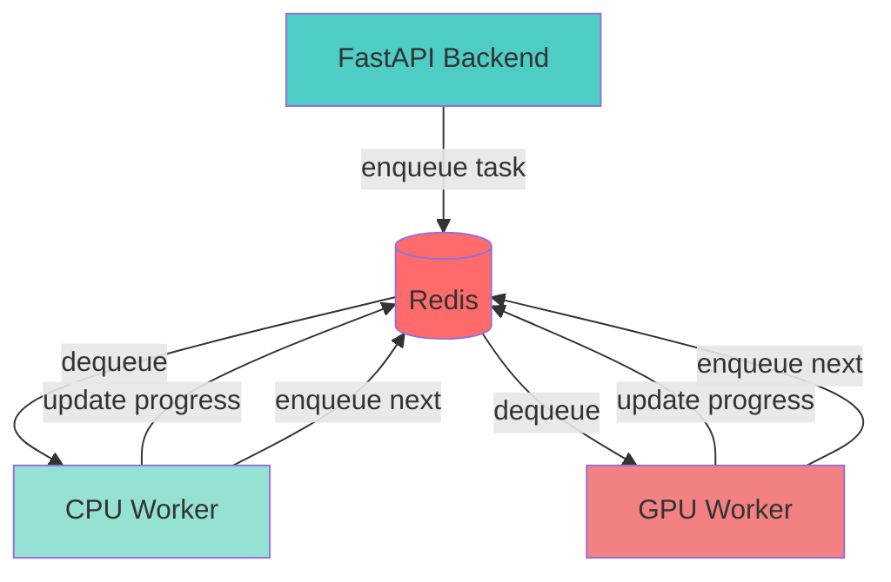
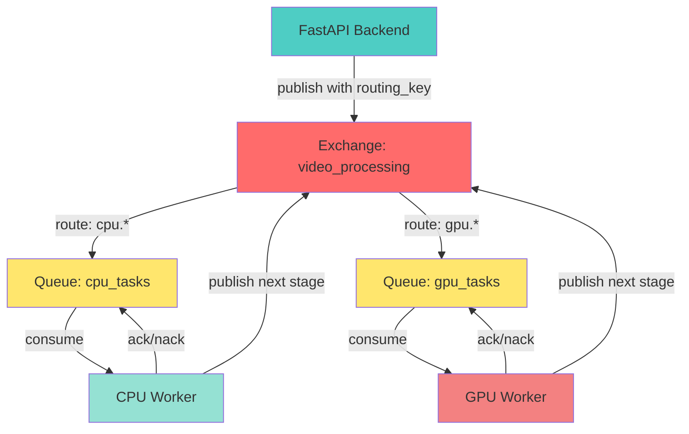
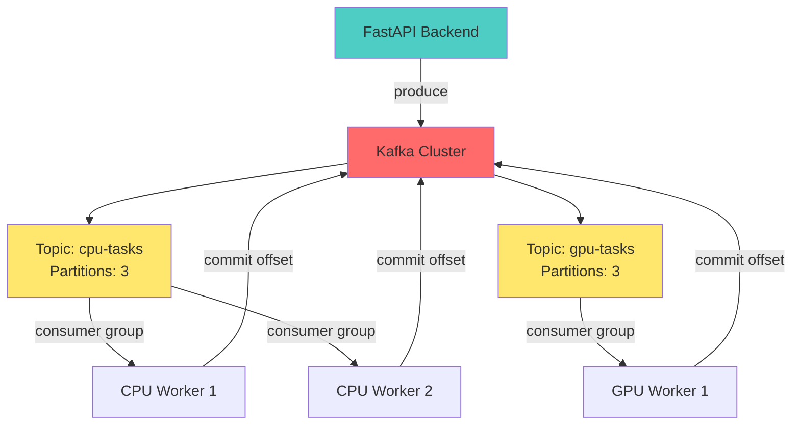

# ADR 001b: Детальное сравнение брокеров очередей

- **Статус:** На рассмотрении
- **Дата:** 2026‑01‑08
- **Связано с:** [ADR 001: Использование Redis](001-use-redis.md)

## Контекст

Требуется детальный анализ выбора брокера очередей для пайплайна обработки видео. Система имеет следующие характеристики:

- **Пайплайн:** Последовательная цепочка стадий (normalize → pose → features → feedback)
- **Очереди:** Две отдельные очереди для CPU и GPU воркеров
- **Масштаб:** MVP с десятками видео в день, потенциал роста
- **Требования:** Приоритеты задач, ретраи, мониторинг прогресса
- **Надёжность:** Средняя критичность (допустимы редкие потери с ретраями)

## Краткая рекомендация

**Для текущего MVP: Redis + RQ** ✅

**При росте нагрузки: RabbitMQ** ⚠️

**Kafka: Не рекомендуется** ❌ (избыточен для данного случая)

### Быстрое сравнение

| Решение | Когда выбирать | Основной плюс | Основной минус |
|---------|---------------|---------------|----------------|
| **Redis + RQ** | MVP, прототип, < 100 задач/день | Простота | Ограниченная надёжность |
| **RabbitMQ** | Продакшен, > 200 задач/день, нужны приоритеты | Гарантии доставки + приоритеты | Сложнее настройка |
| **Kafka** | Миллионы сообщений, event streaming | Пропускная способность | Высокая сложность |

## Архитектурные диаграммы

### Redis + RQ



### RabbitMQ



### Kafka



## Сравнение решений

### 1. Redis + RQ (текущее решение)

**Описание:** Redis как in-memory хранилище с библиотекой RQ (Redis Queue) для Python.

#### Преимущества

- ✅ **Простота развёртывания:** Один контейнер, минимальная конфигурация
- ✅ **Низкая задержка:** In-memory операции, идеально для MVP
- ✅ **Легкая интеграция:** RQ имеет простой Python API
- ✅ **Мониторинг:** Простые команды Redis для просмотра очереди
- ✅ **Гибкость:** Redis можно использовать для кеширования прогресса
- ✅ **Управляемые сервисы:** AWS ElastiCache, GCP MemoryStore, Azure Cache

#### Недостатки

- ❌ **Ограниченная персистентность:** По умолчанию данные в памяти, нужна настройка AOF/RDB
- ❌ **Нет гарантий доставки:** При краше узла задачи могут потеряться
- ❌ **Ограниченные возможности:** Нет сложной маршрутизации, приоритеты через отдельные очереди
- ❌ **Масштабирование:** При росте нагрузки может стать узким местом
- ❌ **Нет транзакций:** Невозможно гарантировать атомарность операций

#### Поддержка приоритетов

RQ поддерживает приоритеты через отдельные очереди с разными приоритетами:
```python
# Высокий приоритет
high_queue = Queue('high', connection=redis_conn)
# Низкий приоритет  
low_queue = Queue('low', connection=redis_conn)
```

#### Когда использовать

- MVP и прототипы
- Низкая/средняя нагрузка (< 1000 задач/час)
- Простые пайплайны без сложной маршрутизации
- Быстрый старт важнее надёжности

---

### 2. RabbitMQ

**Описание:** Полнофункциональный message broker с поддержкой AMQP, множеством паттернов обмена сообщениями.

#### Преимущества

- ✅ **Гарантии доставки:** Publisher confirms, consumer acknowledgments, persistent queues
- ✅ **Гибкая маршрутизация:** Exchanges, routing keys, topic patterns
- ✅ **Приоритеты:** Встроенная поддержка приоритетов сообщений (0-255)
- ✅ **Dead Letter Queue:** Автоматическая обработка failed сообщений
- ✅ **Мониторинг:** Web UI, Prometheus метрики
- ✅ **Надёжность:** Персистентность на диск, репликация через кластер
- ✅ **Множество паттернов:** Work queues, pub/sub, routing, topics
- ✅ **Управляемые сервисы:** AWS MQ, CloudAMQP, Azure Service Bus

#### Недостатки

- ❌ **Сложность настройки:** Требует понимания exchanges, queues, bindings
- ❌ **Больше ресурсов:** Потребляет больше памяти и CPU чем Redis
- ❌ **Кривая обучения:** Нужно изучить концепции AMQP
- ❌ **Для простых случаев избыточен:** Много возможностей, которые могут не понадобиться

#### Поддержка приоритетов

Встроенная поддержка через `priority` в свойствах сообщения:
```python
channel.basic_publish(
    exchange='',
    routing_key='task_queue',
    body=message,
    properties=pika.BasicProperties(priority=10)
)
```

#### Когда использовать

- Продакшен с требованиями надёжности
- Нужна сложная маршрутизация или pub/sub
- Средняя/высокая нагрузка (тысячи задач/час)
- Готовы инвестировать в настройку и поддержку

---

### 3. Apache Kafka

**Описание:** Распределённая платформа для стриминга событий, изначально создана для обработки больших объёмов данных.

#### Преимущества

- ✅ **Высокая пропускная способность:** Миллионы сообщений в секунду
- ✅ **Персистентность:** Все сообщения хранятся на диске с репликацией
- ✅ **Replay:** Возможность перечитывать историю сообщений
- ✅ **Горизонтальное масштабирование:** Легко добавлять брокеры
- ✅ **Потребительские группы:** Автоматический баланс нагрузки между воркерами
- ✅ **Партиционирование:** Параллельная обработка по ключам
- ✅ **Экосистема:** Kafka Connect, Kafka Streams, множество интеграций

#### Недостатки

- ❌ **Высокая сложность:** Требует Zookeeper/KRaft, настройка кластера
- ❌ **Overkill для простых задач:** Создан для больших объёмов данных
- ❌ **Операционная сложность:** Нужен опытный DevOps для поддержки
- ❌ **Задержка:** Не оптимизирован для низкой задержки (лучше для throughput)
- ❌ **Ресурсы:** Требует много памяти и дискового пространства
- ❌ **Нет встроенных приоритетов:** Нужно реализовывать через отдельные топики

#### Поддержка приоритетов

Kafka не поддерживает приоритеты напрямую. Решения:
- Отдельные топики для разных приоритетов
- Кастомная логика в consumer
- Использование заголовков сообщений

#### Когда использовать

- Очень высокая нагрузка (миллионы сообщений)
- Нужен replay/reprocessing
- Event streaming архитектура
- Большие объёмы данных для аналитики
- Команда с опытом работы с Kafka

---

## Сравнительная таблица

| Критерий | Redis + RQ | RabbitMQ | Kafka |
|----------|-----------|----------|-------|
| **Простота развёртывания** | ⭐⭐⭐⭐⭐ | ⭐⭐⭐ | ⭐⭐ |
| **Производительность (latency)** | ⭐⭐⭐⭐⭐ | ⭐⭐⭐⭐ | ⭐⭐⭐ |
| **Производительность (throughput)** | ⭐⭐⭐ | ⭐⭐⭐⭐ | ⭐⭐⭐⭐⭐ |
| **Надёжность доставки** | ⭐⭐ | ⭐⭐⭐⭐⭐ | ⭐⭐⭐⭐⭐ |
| **Приоритеты** | ⭐⭐⭐ (через очереди) | ⭐⭐⭐⭐⭐ | ⭐⭐ (через топики) |
| **Масштабирование** | ⭐⭐⭐ | ⭐⭐⭐⭐ | ⭐⭐⭐⭐⭐ |
| **Мониторинг** | ⭐⭐⭐ | ⭐⭐⭐⭐⭐ | ⭐⭐⭐⭐ |
| **Кривая обучения** | ⭐⭐⭐⭐⭐ | ⭐⭐⭐ | ⭐⭐ |
| **Ресурсы (RAM/CPU)** | ⭐⭐⭐⭐⭐ | ⭐⭐⭐ | ⭐⭐ |
| **Управляемые сервисы** | ⭐⭐⭐⭐⭐ | ⭐⭐⭐⭐ | ⭐⭐⭐ |

## Рекомендации по сценариям

### Сценарий 1: MVP (текущий)
**Рекомендация: Redis + RQ**

- Простота важнее всего
- Низкая нагрузка
- Быстрый старт
- Легко мигрировать позже

### Сценарий 2: Рост нагрузки, нужны приоритеты
**Рекомендация: RabbitMQ**

- Требуется надёжность
- Нужны встроенные приоритеты
- Готовы к умеренной сложности
- Средняя нагрузка

### Сценарий 3: Очень высокая нагрузка, event streaming
**Рекомендация: Kafka**

- Миллионы сообщений
- Нужен replay
- Event-driven архитектура
- Команда с опытом

## Гибридный подход

Возможен поэтапный переход:

1. **Этап 1 (MVP):** Redis + RQ
   - Быстрый старт
   - Простая настройка
   - Достаточно для начальной нагрузки

2. **Этап 2 (Рост):** Миграция на RabbitMQ
   - Когда нагрузка растёт
   - Когда нужны гарантии доставки
   - Когда нужны приоритеты

3. **Этап 3 (Масштаб):** Kafka (если нужно)
   - Только если действительно нужны миллионы сообщений
   - Или event streaming архитектура

## Миграция с Redis на RabbitMQ

Если принято решение мигрировать на RabbitMQ, процесс будет относительно простым благодаря разделению логики:

### Шаги миграции

1. **Установка RabbitMQ:** Добавить в docker-compose
2. **Замена клиента:** Заменить RQ на Celery или pika
3. **Настройка exchanges/queues:** Создать структуру для CPU/GPU очередей
4. **Обновление воркеров:** Изменить код обработки задач
5. **Тестирование:** Параллельный запуск для проверки
6. **Переключение:** Постепенное переключение трафика

### Пример структуры RabbitMQ для проекта

```
Exchange: video_processing
├── Queue: cpu_tasks (routing_key: cpu.*)
│   ├── normalize
│   ├── features  
│   └── feedback
└── Queue: gpu_tasks (routing_key: gpu.*)
    └── pose
```

## Заключение

Для текущего MVP **Redis + RQ остаётся оптимальным выбором** благодаря простоте и достаточности для начальной нагрузки.

**RabbitMQ рекомендуется рассмотреть** когда:
- Нагрузка превысит 100-200 видео в день
- Понадобятся гарантии доставки
- Нужны встроенные приоритеты
- Готовы инвестировать в настройку

**Kafka не рекомендуется** для текущего случая, так как:
- Избыточен для простого пайплайна
- Высокая операционная сложность
- Не оптимизирован для низкой задержки
- Нет встроенных приоритетов

## Следующие шаги

1. Оценить текущую нагрузку и прогноз роста
2. Определить критичность гарантий доставки
3. Принять решение о миграции на RabbitMQ при росте нагрузки
4. Подготовить план миграции (если решение принято)
