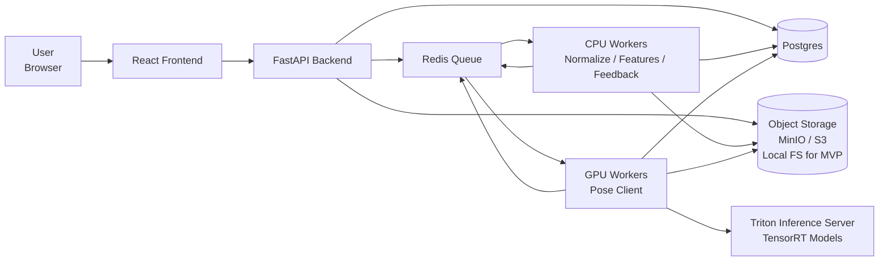
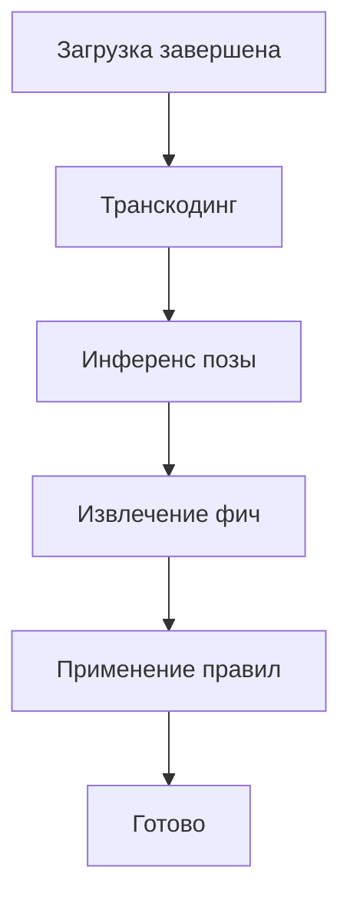

# Архитектура snowboard‑app

В этом документе описана архитектура системы анализа катания на сноуборде. Цель проекта — предоставить райдеру возможность загрузить видео, получить визуализацию позы и краткий фидбек на основе позной аналитики. Архитектура должна быть достаточно простой для MVP, но иметь задел для масштабирования.

## Контейнерная диаграмма

Ниже приведена высокоуровневая схема компонентов и их взаимодействий. Каждая коробка соответствует контейнеру или сервису.

### Компоненты

- **Пользователь / Браузер** — источник данных и потребитель результата. Пользователь выбирает файл, загружает его в хранилище и потом смотрит результат.
- **Фронтенд (React)** — реализует UI: страница загрузки видео, страница просмотра результата, отрисовка позы поверх видео и панель фидбека. Фронтенд общается с API и хранилищем через presigned URL.
- **Backend (FastAPI)** — управляет жизненным циклом видео: создаёт запись, выдаёт presigned URL для загрузки, подтверждает завершение загрузки, ставит задачи в очередь, возвращает статус и ссылки на артефакты. Сервер не занимается обработкой видео, лишь координирует пайплайн.
- **Postgres** — хранит метаданные: записи о видео, стадии обработки, артефакты, версии пайплайна и возможные ошибки.
- **Object Storage (MinIO/S3)** — хранит большие бинарные объекты: оригинальные и нормализованные видео, артефакты (keypoints, features, feedback), промежуточные файлы. Хранилище доступно и для фронта, и для воркеров через presigned URL.
- **Redis (очередь)** — простой брокер задач. API кладёт задачи на обработку, воркеры забирают их и выполняют. Redis также используется для хранения актуального прогресса каждой стадии.
- **CPU‑воркеры** — выполняют задачи, не требующие GPU: транскодинг видео (приведение к единому формату), извлечение фич (вычисление углов, темпов), применение rule‑based правил. Каждый воркер изолирован и может масштабироваться.
- **GPU‑воркеры** — организуют батчинг и вызов инференса на модели позы. Они открывают нормализованное видео, разбивают его на чанки, вызывают Triton, записывают keypoints и обновляют прогресс.
- **Triton Inference Server** — содержит оптимизированную модель (TensorRT). Задача Triton — принимать тензоры, возвращать предсказания. Логика препроцессинга и постпроцессинга вынесена в GPU‑воркеры, чтобы модель оставалась как можно более “чистой”.

## Последовательность обработки

Пайплайн состоит из пяти стадий: загрузка, транскодинг, инференс позы, извлечение фич, применение правил. Последовательность показана на следующей диаграмме.

### Описание стадий

1. **Загрузка**: фронтенд запрашивает через API presigned URL и загружает видео непосредственно в Object Storage. После завершения загрузки отправляется запрос `complete-upload`, который инициирует пайплайн.
2. **Транскодинг**: CPU‑воркер приводит видео к стандарту (фиксированное разрешение, частота кадров, кодек). Также извлекается метадата (длительность, fps, размеры), которая сохраняется в БД. На этой стадии формируется файл `normalized.mp4`.
3. **Инференс позы**: GPU‑воркер читает нормализованное видео порциями кадров, применяет препроцессинг (resize, нормализация), вызывает Triton, постпроцессит выходы модели (конвертация heatmap → координаты), и сохраняет `keypoints_v1.jsonl`. Прогресс считается по числу обработанных кадров.
4. **Извлечение фич**: CPU‑воркер загружает ключевые точки, рассчитывает нужные метрики — углы в коленях, наклон корпуса, расстояние между стопами и т. п. Метрики сглаживаются и нормализуются. Результат сохраняется в `features_v1.json`.
5. **Применение правил**: rule‑engine анализирует вычисленные метрики и формирует список предупреждений/советов. Примеры правил: “колени слишком прямые”, “корпус слишком наклонён”, “большая асимметрия”. Результат сохраняется в `feedback_v1.json`.

## Основные решения

- **Разделение на CPU‑ и GPU‑воркеры.** Это позволяет отдельно масштабировать вычисление поз (GPU) и остальные задачи (CPU). CPU‑воркеры могут быть развёрнуты на дешёвых машинах, в то время как GPU‑воркеры используют ограниченный ресурс.
- **Прямая загрузка в object storage.** Файл видео минует API‑сервер, поэтому API не становится узким местом и не держит в памяти большие файлы.
- **Triton используется только для инференса.** Всё, что касается препроцессинга и постпроцессинга, реализуется в воркере. Это упрощает обновление модели и позволяет сохранить Triton “тонким”.
- **JSONL для keypoints.** Формат “одна строка — один кадр” позволяет писать файл стримингом, не держать весь результат в памяти и легко восстанавливать прогресс после сбоя.
- **Версионирование.** Для каждой стадии и артефакта фиксируется версия: `pipeline_version`, `model_version`, `features_version`, `ruleset_version`. Это позволяет воспроизводить результаты и сравнивать различные версии моделей/правил.

## Масштабирование

Архитектура спроектирована так, чтобы MVP можно было расширять без радикальных изменений:

1. *Горизонтальное масштабирование воркеров.* Можно увеличивать число CPU‑ или GPU‑воркеров в зависимости от узкого места. Очередь Redis помогает распределять нагрузку.
2. *Версионирование моделей и правил.* Можно одновременно поддерживать несколько моделей, отправляя разные видео на разные `model_version`. Это открывает возможность A/B-тестирования.
3. *Новые стадии пайплайна.* Дополнительные шаги (например, 3D‑реконструкция, классификация стилей катания) можно добавлять как новые задачи, сохраняя общую схему.

## Заключение

Предложенная архитектура обеспечивает отделение интерфейса от тяжёлой обработки, надёжность (за счёт очереди и идемпотентности задач), простоту масштабирования и ясные контракты между компонентами. Она подходит для быстрого MVP и закладывает основу для развития продукта.