# Clean-lite Architecture

Документация по архитектуре Clean-lite (Hexagonal/Ports & Adapters), реализованной в фазе 4.5.

## Структура слоев

```
backend/app/
├── domain/              # Доменные модели и бизнес-правила
│   ├── analysis_job.py # AnalysisJob, Stage, статусы, инварианты
│   └── value_objects.py # ArtifactKind, ArtifactRef
│
├── application/         # Application Layer
│   ├── ports/           # Интерфейсы (Protocol)
│   │   ├── job_repo.py      # JobRepo
│   │   ├── queue.py         # Queue (универсальный publish)
│   │   ├── artifact_store.py # ArtifactStore (без presigned URL)
│   │   ├── clock.py         # Clock
│   │   └── uow.py           # UnitOfWork
│   └── use_cases/      # Use Cases (оркестрация)
│       ├── start_analysis.py
│       ├── handle_stage_completed.py
│       ├── finalize_analysis.py
│       ├── fail_analysis.py
│       └── get_analysis_status.py
│
├── adapters/            # Adapters Layer (реализации портов)
│   ├── postgres/        # PostgresJobRepo, PostgresUnitOfWork
│   │   ├── job_repo.py      # PostgresJobRepo
│   │   ├── video_repo.py    # PostgresVideoRepo
│   │   └── uow.py           # PostgresUnitOfWork
│   ├── redis/           # RedisQueue
│   ├── storage/         # StorageArtifactStore
│   └── clock/           # SystemClock
│
├── infrastructure/      # Infrastructure Layer
│   ├── postgres/        # Сессии, миграции, конфигурация БД, ORM модели
│   │   ├── session.py       # SQLAlchemy session factory
│   │   ├── orm_models.py    # Video, JobStage, Artifact (ORM модели)
│   │   └── migrations/      # Alembic миграции
│   └── logging.py       # Структурированное логирование
│
└── composition/         # Composition Root (Dependency Injection)
    ├── container.py     # Container (создает адаптеры из settings)
    └── settings.py     # Settings (pydantic-settings)
```

## Принципы

1. **Domain и Application не импортируют инфраструктуру**: нет импортов SQLAlchemy/Redis/boto3/FastAPI
2. **Порты отражают нужды use cases**: универсальные интерфейсы, не зашитые в инфраструктуру
3. **Разделение lifecycle'ов**: upload (Video) и analysis (AnalysisJob) - разные сущности
4. **Защита от конкуренции**: optimistic locking через `version`, pessimistic через `lock_job()`
5. **Идемпотентность**: доменные методы проверяют состояние перед изменением
6. **Dependency Rule**: зависимости идут только внутрь (Domain ← Application ← Adapters ← Infrastructure)

## Схема взаимодействий

```mermaid
graph TB
    subgraph "API Layer"
        API[FastAPI Routes]
    end
    
    subgraph "Application Layer"
        UC1[StartAnalysis]
        UC2[HandleStageCompleted]
        UC3[FinalizeAnalysis]
        UC4[FailAnalysis]
        UC5[GetAnalysisStatus]
    end
    
    subgraph "Domain Layer"
        AJ[AnalysisJob]
        VO[ValueObjects]
    end
    
    subgraph "Ports Interfaces"
        JR[JobRepo Protocol]
        QU[Queue Protocol]
        AS[ArtifactStore Protocol]
        CL[Clock Protocol]
    end
    
    subgraph "Adapters Layer"
        PGR[PostgresJobRepo]
        RQ[RedisQueue]
        ST[StorageArtifactStore]
        SC[SystemClock]
    end
    
    subgraph "Infrastructure"
        DB[(PostgreSQL)]
        RD[(Redis)]
        FS[FileSystem/S3]
    end
    
    subgraph "Composition"
        CNT[Container]
        SET[Settings]
    end
    
    API -->|uses| CNT
    CNT -->|reads| SET
    CNT -->|wires| UC1
    CNT -->|wires| UC2
    CNT -->|wires| UC3
    CNT -->|wires| UC4
    CNT -->|wires| UC5
    
    UC1 -->|depends on| JR
    UC1 -->|depends on| QU
    UC1 -->|depends on| CL
    UC2 -->|depends on| JR
    UC2 -->|depends on| QU
    UC2 -->|depends on| CL
    UC3 -->|depends on| JR
    UC3 -->|depends on| CL
    UC4 -->|depends on| JR
    UC4 -->|depends on| CL
    UC5 -->|depends on| JR
    
    UC1 -->|uses| AJ
    UC2 -->|uses| AJ
    UC3 -->|uses| AJ
    UC4 -->|uses| AJ
    UC5 -->|returns| AJ
    
    AJ -->|uses| VO
    
    PGR -.->|implements| JR
    RQ -.->|implements| QU
    ST -.->|implements| AS
    SC -.->|implements| CL
    
    CNT -->|creates from settings| PGR
    CNT -->|creates from settings| RQ
    CNT -->|creates from settings| ST
    CNT -->|creates| SC
    
    PGR -->|queries| DB
    RQ -->|enqueues| RD
    ST -->|reads/writes| FS
```



## Поток данных

### Запуск анализа (StartAnalysis)

1. API вызывает `container.start_analysis.execute(video_id)`
2. Use case получает/создает job через `job_repo.lock_job()`
3. Проверяет инварианты (статус должен быть CREATED)
4. Обновляет статус на QUEUED → RUNNING
5. Публикует TRANSCODE через `queue.publish(TRANSCODE, video_id)`
6. Сохраняет job через `job_repo.save_job()`

### Завершение стадии (HandleStageCompleted)

1. Воркер вызывает `container.handle_stage_completed.execute(video_id, stage, artifacts)`
2. Use case получает job через `job_repo.lock_job()` (защита от конкуренции)
3. Проверяет идемпотентность (если стадия уже DONE → no-op)
4. Вызывает `job.mark_stage_done(stage)` (доменный метод с инвариантами)
5. Если FEEDBACK → вызывает `finalize_analysis.execute()`
6. Иначе → публикует следующую стадию через `queue.publish(next_stage, video_id)`
7. Сохраняет job через `job_repo.save_job()`

### Финализация (FinalizeAnalysis)

1. Вызывается из `HandleStageCompleted` или напрямую
2. Получает job через `job_repo.lock_job()`
3. Вызывает `job.finalize()` (проверяет, что все стадии DONE)
4. Сохраняет job через `job_repo.save_job()`

## Защита от конкуренции

### Optimistic Locking

- `AnalysisJob.version` увеличивается при каждом изменении
- `PostgresJobRepo.save_job()` проверяет версию (TODO: добавить version column в Video)
- При конфликте выбрасывается `ValueError`

### Pessimistic Locking

- `JobRepo.lock_job()` использует `SELECT FOR UPDATE`
- Используется в use cases перед изменением состояния

### Идемпотентность

- Доменные методы (`mark_stage_done`, `mark_stage_running`) проверяют текущее состояние
- Если стадия уже DONE, повторный вызов — no-op
- `HandleStageCompleted` проверяет статус перед обработкой

## Архитектурные решения и компромиссы

### Dependency Rule и размещение ORM моделей

**Проблема:** В строгой чистой архитектуре зависимости должны идти только внутрь:
```
Domain ← Application ← Adapters ← Infrastructure
```

**Текущая структура (компромисс):**
- ORM модели находятся в `infrastructure/postgres/orm_models.py`
- Адаптеры (`adapters/postgres/`) импортируют их из Infrastructure
- Это создает зависимость наружу: `Adapters → Infrastructure` ⚠️

**Обоснование компромисса:**
1. ✅ **Логическая связность**: ORM модели - это инфраструктурные детали (SQLAlchemy, PostgreSQL)
2. ✅ **Практичность**: ORM модели используются миграциями Alembic, которые находятся в Infrastructure
3. ✅ **Естественное размещение**: ORM модели логически относятся к инфраструктуре БД, а не к адаптерам
4. ⚠️ **Компромисс**: Нарушение строгой Dependency Rule, но это позволяет значительно упростить код, реализовав адаптеры на прямую для PosrgresSQL, без добавления лишних абстракций для ORM моделей.

**Альтернативные подходы (рассматривались, но отклонены):**
- Размещение ORM моделей в Adapters: нарушает логическую связность (модели - это инфра, а не адаптер)
- Создание абстракции для ORM моделей: усложняет код без реальной пользы
- Dependency Injection для моделей: не практичен в Python для ORM

### Clean-lite:

- Domain и Application изолированы от инфраструктуры
- Порты позволяют легко мокировать для тестов
- Use cases содержат только оркестрацию
- Инварианты живут в domain моделях
- ORM модели в Infrastructure (компромисс для практичности)

## Использование

### В API (FastAPI routes)

```python
from backend.app.composition.container import Container
from backend.app.composition.settings import load_settings

# Создать container при старте приложения
settings = load_settings()
container = Container(settings)

# В роуте
@router.post("/videos/{video_id}/complete-upload")
async def complete_upload(video_id: UUID, container: Container = Depends(get_container)):
    use_cases = container.build_use_cases(container.get_session())
    use_cases.start_analysis.execute(video_id)
    return {"status": "started"}
```

### В воркерах

```python
from backend.app.composition.container import Container
from backend.app.composition.settings import load_settings

settings = load_settings()
container = Container(settings)

def transcode_task(video_id: str):
    # ... обработка видео ...
    # После успешной обработки:
    session = container.get_session()
    use_cases = container.build_use_cases(session)
    try:
        use_cases.handle_stage_completed.execute(
            video_id=UUID(video_id),
            stage=Stage.TRANSCODE,
            artifacts=[ArtifactRef(...)],
        )
    finally:
        session.close()
```

## Тестирование

### Import-check тесты

Проверяют, что `domain/` и `application/` не импортируют инфраструктурные зависимости:
- `tests/test_clean_architecture.py`

### Unit-тесты use cases

Тестируют use cases изолированно с моками портов:
- `tests/test_use_cases.py`

## Следующие шаги

После реализации фазы 4.5:

1. **Фаза 5**: Реализовать API endpoints через use cases
2. **Фаза 7+**: Воркеры будут использовать use cases вместо прямого изменения БД
3. **Улучшения**: Добавить version column в Video для proper optimistic locking

