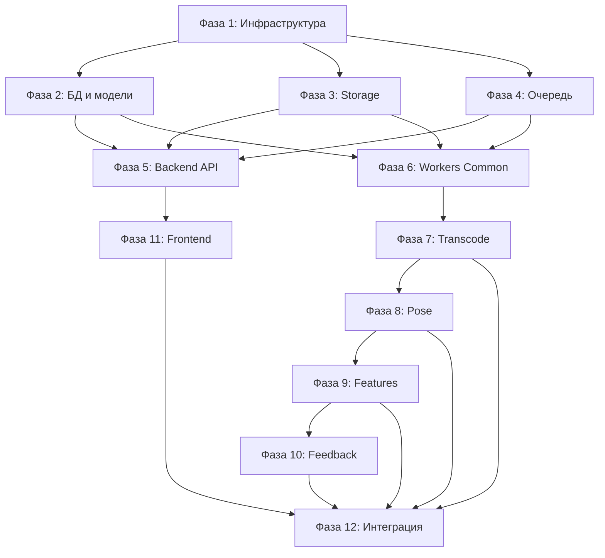

# План разработки snowboard-app

## Принципы разработки

1. **Снизу вверх**: Сначала инфраструктура и базовые модули, затем бизнес-логика
2. **По зависимостям**: Модули, от которых зависят другие, разрабатываются первыми
3. **По пайплайну**: Воркеры разрабатываются в порядке обработки (transcode → pose → features → feedback)
4. **Итеративно**: Каждый этап можно протестировать независимо

## Фаза 1: Инфраструктура и базовая настройка

### 1.1 Docker и окружение

- Настроить `docker-compose.yml` (Postgres, Redis, без MinIO для MVP)
- Создать Dockerfile для API, CPU/GPU воркеров
- Настроить `.env.example` с переменными окружения
- Создать базовые скрипты (`dev_up.sh`, `dev_down.sh`)

**Файлы:** `infra/docker-compose.yml`, `infra/docker/*.Dockerfile`, `.env.example`

### 1.2 Конфигурация и логирование

- Реализовать `backend/app/core/config.py` (Settings с pydantic-settings)
- Реализовать `backend/app/core/logging.py` (структурированное логирование)
- Реализовать `backend/app/presentation/workers/common/config.py` (общая конфигурация для воркеров)
- Реализовать `backend/app/presentation/workers/common/logging.py` (логирование для воркеров)

**Зависимости:** Нет

**Тестирование:** Проверить чтение конфига и логирование

## Фаза 2: База данных и модели

### 2.1 Модели данных

- Реализовать `backend/app/db/models.py`:
  - `Video` (id, status, etc.)
  - `JobStage` (video_id, name, status, started_at, ended_at)
  - `Artifact` (video_id, kind, version, object_key)
- Настроить `backend/app/db/session.py` (SQLAlchemy session)
- Создать миграции Alembic

**Зависимости:** Фаза 1.2

**Тестирование:** Создать тестовые записи, проверить CRUD операции

### 2.2 Схемы API

- Реализовать `backend/app/presentation/api/schemas/videos.py`:
  - `CreateVideoRequest`, `CreateVideoResponse`
  - `VideoStatusResponse`, `ArtifactResponse`
- Валидация через Pydantic

**Зависимости:** Фаза 2.1

**Тестирование:** Проверить сериализацию/десериализацию

## Фаза 3: Storage Backend

### 3.1 Абстракция Storage

- Создать `backend/app/storage/base.py` (абстрактный интерфейс StorageBackend)
- Реализовать `backend/app/storage/local.py` (LocalStorageBackend для MVP)
- Реализовать `backend/app/storage/s3.py` (S3StorageBackend, опционально)
- Создать фабрику `backend/app/storage/__init__.py` (create_storage_backend)
- Реализовать `backend/app/services/storage.py` (get_storage helper)

**Зависимости:** Фаза 1.2

**Тестирование:** Unit-тесты для upload/download, проверка создания директорий

### 3.2 Storage для воркеров

- Реализовать `backend/app/presentation/bootstrap/runtime.py` (get_storage)
- Обеспечить доступ воркеров к файлам

**Зависимости:** Фаза 3.1

**Тестирование:** Проверить чтение/запись файлов из воркеров

## Фаза 4: Очередь задач

### 4.1 Redis клиент

- Реализовать `backend/app/clients/redis.py` (подключение к Redis)
- Реализовать `backend/app/clients/queue.py` (RQ клиент для постановки задач)

**Зависимости:** Фаза 1.2

**Тестирование:** Проверить подключение, постановку задач в очередь

### 4.2 Регистрация задач

- Реализовать `backend/app/presentation/workers/rq/tasks.py` (декораторы для задач RQ)
- Реализовать `backend/app/presentation/workers/rq/rq_worker.py` (точка входа для воркеров)
- Настроить очереди: `cpu` и `gpu`

**Зависимости:** Фаза 4.1

**Тестирование:** Запустить воркер, проверить обработку тестовых задач

## Фаза 5: Backend API (базовые endpoints)

### 5.1 Health checks

- Реализовать `backend/app/presentation/api/routes/health.py`:
  - `GET /health` (liveness)
  - `GET /health/ready` (readiness: БД, Redis, Storage)

**Зависимости:** Фаза 2.1, 3.1, 4.1

**Тестирование:** Проверить endpoints, readiness checks

### 5.2 Основные API endpoints

- Реализовать `backend/app/presentation/api/routes/videos.py`:
  - `POST /v1/videos` (создание видео, генерация upload URL)
  - `POST /v1/videos/{id}/complete-upload` (запуск пайплайна)
  - `GET /v1/videos/{id}` (статус и прогресс)
  - `GET /v1/videos/{id}/artifacts` (список артефактов)
- Реализовать `backend/app/presentation/api/routes/files.py` (для локального storage):
  - `GET /api/v1/files/{key}` (скачивание файла)
  - `PUT /api/v1/files/upload` (загрузка файла)

**Зависимости:** Фаза 2.1, 2.2, 3.1, 4.1, 5.1

**Тестирование:** Интеграционные тесты API endpoints

### 5.3 Сервисы Backend

- Реализовать `backend/app/services/jobs.py` (постановка задач в очередь)
- Реализовать `backend/app/services/progress.py` (чтение прогресса из Redis/БД)
- Реализовать `backend/app/services/artifacts.py` (работа с артефактами)
- Реализовать `backend/app/services/model_registry.py` (проверка модели Triton)

**Зависимости:** Фаза 4.1, 5.2

**Тестирование:** Unit-тесты сервисов

### 5.4 Main application

- Реализовать `backend/app/main.py` (FastAPI app, подключение роутов)
- Настроить middleware (CORS, error handling)

**Зависимости:** Фаза 5.2

**Тестирование:** Запустить API, проверить все endpoints

## Фаза 6: Workers Common

### 6.1 Общие утилиты

- Реализовать `backend/app/presentation/bootstrap/runtime.py` (get_session)
- Реализовать `backend/app/presentation/workers/common/progress.py` (обновление прогресса в Redis)
- Реализовать `backend/app/presentation/workers/common/schemas.py` (валидация артефактов)
- Реализовать `backend/app/presentation/workers/common/contracts.py` (чтение контрактов модели)
- Реализовать `backend/app/presentation/workers/common/video_io.py` (работа с видео файлами)

**Зависимости:** Фаза 2.1, 3.2, 4.1

**Тестирование:** Unit-тесты утилит

## Фаза 7: Workers - Transcode (CPU)

### 7.1 Transcode Worker

- Реализовать `backend/app/presentation/workers/cpu/transcode/run.py`:
  - Чтение оригинального видео из storage
  - Нормализация через ffmpeg (разрешение, FPS, кодек)
  - Извлечение метаданных (длительность, fps, размеры)
  - Сохранение normalized.mp4 в storage
  - Обновление статуса в БД
  - Постановка задачи pose в очередь

**Зависимости:** Фаза 6.1

**Тестирование:** Обработать тестовое видео, проверить normalized.mp4

## Фаза 8: Workers - Pose Inference (GPU)

### 8.1 Triton Client

- Реализовать `backend/app/presentation/workers/gpu/pose/triton_client.py` (клиент для Triton Inference Server)
- Проверка доступности модели, чтение контракта

**Зависимости:** Фаза 6.1

**Тестирование:** Подключиться к Triton, выполнить тестовый inference

### 8.2 Preprocessing и Postprocessing

- Реализовать `backend/app/presentation/workers/gpu/pose/preprocessing.py`:
  - Нарезка видео на батчи кадров
  - Препроцессинг (resize, нормализация пикселей)
  - Подготовка тензоров для Triton
- Реализовать `backend/app/presentation/workers/gpu/pose/postprocessing.py`:
  - Конвертация heatmaps → координаты keypoints
  - Фильтрация по confidence
  - Нормализация координат [0..1]

**Зависимости:** Фаза 8.1

**Тестирование:** Unit-тесты пре/постпроцессинга

### 8.3 Pose Worker

- Реализовать `backend/app/presentation/workers/gpu/pose/run.py`:
  - Чтение normalized.mp4 из storage
  - Обработка батчами через Triton
  - Запись keypoints_v1.jsonl (JSONL формат, стриминг)
  - Обновление прогресса (по кадрам)
  - Сохранение keypoints_v1.jsonl в storage
  - Постановка задачи features в очередь

**Зависимости:** Фаза 8.2

**Тестирование:** Обработать normalized.mp4, проверить keypoints_v1.jsonl

## Фаза 9: Workers - Features (CPU)

### 9.1 Features Worker

- Реализовать `backend/app/presentation/workers/cpu/features/run.py`:
  - Чтение keypoints_v1.jsonl из storage
  - Вычисление метрик:
    - Углы в коленях (knee_flex_deg)
    - Наклон корпуса (torso_lean_deg)
    - Расстояние между стопами
    - Другие метрики из схемы
  - Сглаживание временных рядов
  - Агрегация по сегментам
  - Сохранение features_v1.json в storage
  - Постановка задачи feedback в очередь

**Зависимости:** Фаза 6.1

**Тестирование:** Обработать keypoints_v1.jsonl, проверить features_v1.json

## Фаза 10: Workers - Feedback (CPU)

### 10.1 Feedback Worker

- Реализовать `backend/app/presentation/workers/cpu/feedback/run.py`:
  - Чтение features_v1.json из storage
  - Чтение правил из `rules/feedback/v1.yaml`
  - Применение правил к метрикам
  - Генерация feedback items (severity, title, detail, t_ranges)
  - Сохранение feedback_v1.json в storage
  - Обновление статуса видео: completed

**Зависимости:** Фаза 6.1

**Тестирование:** Обработать features_v1.json, проверить feedback_v1.json

## Фаза 11: Frontend

### 11.1 API Client

- Реализовать `frontend/src/lib/api.ts` (типизированный клиент API)
- Функции для всех endpoints

**Зависимости:** Фаза 5.2

**Тестирование:** Проверить вызовы API

### 11.2 Компоненты

- Реализовать `frontend/src/components/VideoPlayer.tsx` (видеоплеер)
- Реализовать `frontend/src/components/PoseCanvasOverlay.tsx`:
  - Загрузка keypoints_v1.jsonl
  - Отрисовка скелета поверх видео
  - Синхронизация с временной меткой
- Реализовать `frontend/src/components/FeedbackPanel.tsx`:
  - Отображение feedback_v1.json
  - Фильтрация по severity
  - Визуализация временных диапазонов

**Зависимости:** Фаза 11.1

**Тестирование:** Проверить отрисовку на тестовых данных

### 11.3 Страницы

- Реализовать `frontend/src/pages/Upload.tsx`:
  - Выбор файла
  - Загрузка через API
  - Отображение прогресса
- Реализовать `frontend/src/pages/VideoResult.tsx`:
  - Интеграция VideoPlayer + PoseCanvasOverlay + FeedbackPanel
  - Отображение статуса обработки

**Зависимости:** Фаза 11.2

**Тестирование:** E2E тест загрузки и просмотра результата

## Фаза 12: Интеграция и тестирование

### 12.1 End-to-end тестирование

- Протестировать полный пайплайн:

  1. Загрузка видео через фронтенд
  2. Обработка через все стадии
  3. Отображение результата

- Проверить обработку ошибок
- Проверить идемпотентность

### 12.2 Оптимизация

- Оптимизация производительности воркеров
- Настройка батчинга для GPU воркера
- Оптимизация запросов к БД

### 12.3 Документация

- Обновить README с инструкциями
- Добавить примеры использования API
- Документировать формат правил feedback

## Диаграмма зависимостей

## Рекомендации по разработке

1. **Начинать с Фаз 1-4**: Без них невозможно тестировать остальное
2. **Параллельная разработка**: После Фазы 5 можно параллельно разрабатывать воркеры (Фазы 7-10) и фронтенд (Фаза 11)
3. **Итеративное тестирование**: После каждой фазы запускать тесты и проверять работоспособность
4. **Моки для зависимостей**: При разработке воркеров можно использовать моки для Triton и storage
5. **Приоритет MVP**: Сначала реализовать минимальную функциональность, затем добавлять оптимизации

## Критический путь

Для быстрого MVP критический путь:

1. Фазы 1-5 (инфраструктура + API) - 2-3 недели
2. Фаза 7 (Transcode) - 3-5 дней
3. Фаза 8 (Pose) - 1-2 недели (самый сложный)
4. Фаза 9 (Features) - 3-5 дней
5. Фаза 10 (Feedback) - 2-3 дня
6. Фаза 11 (Frontend) - 1 неделя
7. Фаза 12 (Интеграция) - 3-5 дней

**Итого для MVP: 5-7 недель**