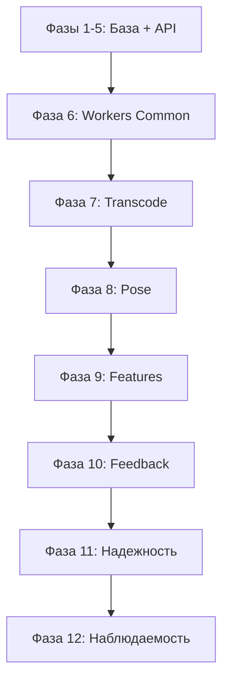

# План развития workers snowboard-app (Clean Architecture)

Этот план продолжает развитие **workers-пайплайна** с соблюдением Clean Architecture:
- доменная логика и переходы стадий живут в `backend/app/domain/` и `backend/app/application/`;
- воркеры - тонкие consumers: читают артефакты, вызывают use cases, публикуют результаты;
- инфраструктура (Redis, Postgres, Storage, Triton) скрыта за портами.

Фазы 1-5 считаются завершенными и служат базой для следующих шагов.

---

## Принципы для workers

1. **Снизу вверх**: инфраструктура и базовые зависимости перед бизнес-логикой.
2. **По зависимостям**: модули, от которых зависят другие — раньше.
3. **По пайплайну**: transcode → pose → features → feedback.
4. **Clean-lite границы**:
   - `domain/` и `application/` не импортируют FastAPI/SQLAlchemy/redis/boto3/tritonclient.
   - всё общение с внешним миром через **Ports**.
5. **Итеративно**: каждый этап должен быть тестируем отдельно.

---

## Target Architecture (Clean-lite)

### Слои и зависимости (внутрь)

- **Domain**: `AnalysisJob`, статусы/переходы, `VideoRef`, `ModelSignature`.
- **Application (Use Cases)**: `StartAnalysis`, `HandleStageCompleted`, `FinalizeAnalysis`, `FailAnalysis`, (и read-only use cases для API: `GetStatus`, `ListArtifacts`).
- **Ports** (интерфейсы): `JobRepo`, `Queue`, `ArtifactStore`, `InferenceClient`, `Clock`.
- **Adapters**: реализации портов для Postgres/Redis/Storage/Triton.
- **FastAPI + worker-consumers**: только вход/выход и вызов use cases.

---

## Фаза 1: Инфраструктура и базовая настройка

### 1.1 Docker и окружение

- Настроить `docker-compose.yml` (Postgres, Redis, без MinIO для MVP).
- Создать Dockerfile для API, CPU/GPU воркеров.
- Настроить `.env.example` с переменными окружения.
- Создать базовые скрипты (`dev_up.sh`, `dev_down.sh`).

**Файлы:** `infra/docker-compose.yml`, `infra/docker/*.Dockerfile`, `.env.example`

### 1.2 Конфигурация и логирование

- Реализовать `backend/app/composition/settings.py` (Settings с pydantic-settings).
- Реализовать `backend/app/infrastructure/logging.py` (структурированное логирование).
- Реализовать `workers/common/config.py` (общая конфигурация для воркеров).
- Реализовать `workers/common/logging.py` (логирование для воркеров).

**Зависимости:** нет  
**Тестирование:** проверить чтение конфига и логирование.

---

## Фаза 2: База данных и модели

### 2.1 Модели данных

- Реализовать `backend/app/infrastructure/postgres/orm_models.py`:
  - `Video` (id, status, etc.)
  - `JobStage` (video_id, name, status, started_at, ended_at)
  - `Artifact` (video_id, kind, version, object_key)
- Настроить `backend/app/infrastructure/postgres/session.py` (SQLAlchemy session factory).
- Создать миграции Alembic.

**Зависимости:** фаза 1.2  
**Тестирование:** создать тестовые записи, проверить CRUD.

### 2.2 Схемы API

- Реализовать `backend/app/api/schemas/videos.py`:
  - `CreateVideoRequest`, `CreateVideoResponse`
  - `VideoStatusResponse`, `ArtifactResponse`
- Валидация через Pydantic.

**Зависимости:** фаза 2.1  
**Тестирование:** сериализация/десериализация.

---

## Фаза 3: Storage Backend

### 3.1 Абстракция Storage (как Adapter, но можно начать сейчас)

- Создать `backend/app/adapters/storage/base.py` (реализация порта `ArtifactStore` или базовая абстракция).
- Реализовать `backend/app/adapters/storage/local_store.py` (Local storage для MVP).
- Реализовать `backend/app/adapters/storage/s3_store.py` (опционально).
- Фабрика `backend/app/adapters/storage/factory.py` (create store).

**Зависимости:** фаза 1.2  
**Тестирование:** unit-тесты upload/download, создание директорий.

### 3.2 Storage для воркеров

- `workers/common/storage.py` использует тот же backend и совместимые ключи/пути.

**Зависимости:** фаза 3.1  
**Тестирование:** воркер читает/пишет файлы.

---

## Фаза 4: Очередь задач (Redis)

### 4.1 Redis клиент

- `backend/app/adapters/redis/redis_client.py` (подключение к Redis).
- `backend/app/adapters/redis/queue.py` (реализация порта `Queue` поверх RQ/Redis).

**Зависимости:** фаза 1.2  
**Тестирование:** подключение, постановка задач.

### 4.2 Регистрация задач

- `workers/queue/tasks.py` (регистрация/декораторы для задач).
- `workers/queue/rq_worker.py` (точка входа воркеров).
- Очереди: `cpu` и `gpu`.

**Зависимости:** фаза 4.1  
**Тестирование:** запустить воркер, обработать тестовую задачу.

---

## Фаза 4.5: Clean-lite каркас (новая)

Цель: добавить “рельсы” архитектуры **до** активной разработки API и воркеров, без переписывания всего.

### 4.5.1 Структура пакетов

В `backend/app/` добавить:

- `domain/`
- `application/`
- `application/ports/`
- `adapters/` (частично уже начнётся в фазах 3–4)
- `composition/`

### 4.5.2 Domain (минимум)

- `domain/analysis_job.py`
  - `AnalysisJobStatus` (enum)
  - `Stage` (enum: TRANSCODE/POSE/FEATURES/FEEDBACK)
  - `AnalysisJob` (state machine, инварианты)
- `domain/value_objects.py`
  - `VideoRef`
  - `ModelSignature`

**Минимальные инварианты:**
- стадии завершаются по порядку;
- `SUCCEEDED` только после успешного `FEEDBACK`.

### 4.5.3 Ports (интерфейсы)

- `application/ports/job_repo.py`: `JobRepo`
- `application/ports/queue.py`: `Queue`
- `application/ports/artifact_store.py`: `ArtifactStore`
- `application/ports/clock.py`: `Clock`
- `application/ports/uow.py`: `UnitOfWork`

(Порт `InferenceClient` добавить в фазе 8.)

### 4.5.4 Composition root и Infrastructure

- `composition/container.py`:
  - wiring адаптеров (Postgres/Redis/Storage/Clock)
  - передача их в use cases
- `composition/settings.py`: Settings с pydantic-settings
- `infrastructure/postgres/orm_models.py`: ORM модели
- `infrastructure/postgres/session.py`: SQLAlchemy session factory
- `infrastructure/postgres/migrations/`: Alembic миграции
- `infrastructure/logging.py`: структурированное логирование

**Тестирование:** import-check: domain/application не тянут инфраструктурные импорты.

---

## Фаза 5: Backend API (через Use Cases)

### 5.0 Use Cases (новый обязательный подпункт)

В `application/use_cases/`:

- `start_analysis.py` → `StartAnalysis`
- `get_status.py` → `GetAnalysisStatus` (read-only, нужен API)
- `list_artifacts.py` → `ListArtifacts` (read-only)
- `handle_stage_completed.py` → `HandleStageCompleted` (понадобится воркерам)
- `finalize_analysis.py` → `FinalizeAnalysis`
- `fail_analysis.py` → `FailAnalysis`

**Важно:** use cases зависят только от `domain` и `ports`.

### 5.1 Health checks

- `GET /health`
- `GET /health/ready` (readiness: БД, Redis, Storage через adapters)

**Зависимости:** 2.1, 3.1, 4.1

### 5.2 Основные API endpoints

- `POST /v1/videos` (создание видео, генерация upload URL/ключа)
- `POST /v1/videos/{id}/complete-upload` (вызывает `StartAnalysis`)
- `GET /v1/videos/{id}` (вызывает `GetAnalysisStatus`)
- `GET /v1/videos/{id}/artifacts` (вызывает `ListArtifacts`)

Локальный storage:
- `GET /api/v1/files/{key}` (скачивание)
- `PUT /api/v1/files/upload` (загрузка)

**Зависимости:** 2.1, 2.2, 3.1, 4.1, 5.0

### 5.3 Adapters (вместо backend/app/services/*)

Сделать реализации портов:

- `adapters/postgres/job_repo.py` (JobRepo)
- `adapters/postgres/uow.py` (UnitOfWork)
- `adapters/redis/queue.py` (Queue)
- `adapters/storage/artifact_store.py` (ArtifactStore)
- `adapters/clock/system_clock.py` (Clock)

**Примечание:** ORM модели находятся в `infrastructure/postgres/orm_models.py`, а не в adapters.

**Важно:** “progress/artifacts/model_registry” — это либо read-only use cases, либо часть adapter’ов, но не “services”.

### 5.4 Main application

- `backend/app/main.py`:
  - подключение роутов
  - middleware (CORS, error handling)
  - создание контейнера зависимостей (composition)

---

## Фаза 6: Workers Common (адаптеры + утилиты)

**Цель:** унифицировать доступ к БД, Storage, контрактам и общим операциям для всех воркеров.

1. **Воркеры не принимают решений о статусах.** Только вызывают use cases (`HandleStageCompleted`, `FailAnalysis`).
2. **Не зависит от инфраструктуры в домене.** Воркеры зависят от адаптеров/портов, но не наоборот.
3. **Явные контракты артефактов.** Все вход/выходы валидируются через `schemas/` и `contracts/`.
4. **Идемпотентность по умолчанию.** Повторные задачи не должны ломать состояние.
### Задачи
- `backend/app/presentation/bootstrap/runtime.py` (get_session): подключение к БД для воркеров (read/write) и повторное использование настроек.
- `backend/app/presentation/bootstrap/runtime.py` (get_storage): единый клиент storage (local/S3), совместимый с API.
- `backend/app/presentation/workers/common/video_io.py`: чтение/запись видео, утилиты для ffmpeg.
- `backend/app/presentation/workers/common/contracts.py`: загрузка контрактов модели и схем.
- `backend/app/presentation/workers/common/schemas.py`: валидация артефактов `keypoints_v1.jsonl`, `features_v1.json`, `feedback_v1.json`.
- `backend/app/presentation/workers/common/progress.py`: единый механизм прогресса/логирования этапов.

**Зависимости:** фазы 1-5.
**Готовность:** все воркеры используют одинаковые helpers и не дублируют логику.

---

## Фаза 7: Transcode Worker (CPU)

**Цель:** нормализовать видео и инициировать следующий этап пайплайна.

### Задачи
- `backend/app/presentation/workers/cpu/transcode/run.py`:
  - скачать оригинальное видео из storage;
  - выполнить нормализацию (ffmpeg);
  - сохранить `normalized.mp4` в storage;
  - вызвать `HandleStageCompleted` со стадией `TRANSCODE` и артефактом.
- обработка ошибок через `FailAnalysis`.
- unit/smoke тест обработки малого видео.

**Зависимости:** фаза 6.
**Готовность:** при успехе задача `POSE` появляется в очереди через use case.

---

## Фаза 8: Pose Worker (GPU) + Triton adapter

**Цель:** inference позы и генерация keypoints.

### Задачи
- `application/ports/inference_client.py`: порт для inference (если не добавлен ранее).
- `backend/app/presentation/workers/gpu/pose/triton_client.py`: реализация `InferenceClient`.
- `backend/app/presentation/workers/gpu/pose/preprocessing.py`: подготовка кадров/тензоров.
- `backend/app/presentation/workers/gpu/pose/postprocessing.py`: heatmaps -> keypoints, фильтры confidence.
- `backend/app/presentation/workers/gpu/pose/run.py`:
  - чтение `normalized.mp4`;
  - inference батчами;
  - запись `keypoints_v1.jsonl`;
  - вызов `HandleStageCompleted(stage=POSE, artifacts=[...])`.

**Зависимости:** фазы 6-7.
**Готовность:** при успехе очередь получает `FEATURES`.

---

## Фаза 9: Features Worker (CPU)

**Цель:** вычисление фич из keypoints.

### Задачи
- `backend/app/presentation/workers/cpu/features/run.py`:
  - чтение `keypoints_v1.jsonl`;
  - вычисление метрик и временных рядов;
  - запись `features_v1.json`;
  - вызов `HandleStageCompleted(stage=FEATURES, artifacts=[...])`.
- минимальная валидация и тест на sample данных.

**Зависимости:** фаза 8.
**Готовность:** при успехе очередь получает `FEEDBACK`.

---

## Фаза 10: Feedback Worker (CPU)

**Цель:** применение правил и генерация итогового фидбека.

### Задачи
- `backend/app/presentation/workers/cpu/feedback/run.py`:
  - чтение `features_v1.json`;
  - загрузка `rules/feedback/v1.yaml`;
  - генерация `feedback_v1.json`;
  - вызов `HandleStageCompleted(stage=FEEDBACK, artifacts=[...])`.
- инициировать `FinalizeAnalysis` через use case (если не входит в `HandleStageCompleted`).

**Зависимости:** фаза 9.
**Готовность:** статус видео `completed`, все артефакты доступны через API.

---

## Фаза 11: Оркестрация, надежность, идемпотентность

**Цель:** стабильный пайплайн без побочных эффектов от повторов и с четкой обработкой ошибок.

### Задачи
- idempotency key для задач (`event_id`) + таблица `processed_events` в Postgres.
- защита от повторов в `HandleStageCompleted` и `FailAnalysis`.
- retry policy в очереди (RQ): backoff, max_retries.
- fail-fast при несоответствии версий артефактов (`pipeline_version`, `ruleset_version`).

**Зависимости:** фазы 6-10.
**Готовность:** повторные сообщения не создают дубликатов артефактов и не ломают статус.

---

## Фаза 12: Наблюдаемость, эксплуатация и оптимизация

**Цель:** управляемость и производительность пайплайна.

### Задачи
- метрики по стадиям (latency, throughput, errors) + health checks workers.
- логирование с correlation-id (video_id/job_id) во всех воркерах.
- лимиты очередей и worker autoscaling (опционально, k8s/terraform).
- оптимизация GPU батчинга, IO и хранения артефактов.
- обновление `docs/operations.md` и `README.md` по workers.

**Зависимости:** фазы 6-11.
**Готовность:** понятные SLO/алерты, документированные точки отказа.

---

## Диаграмма зависимостей (workers-фокус)

