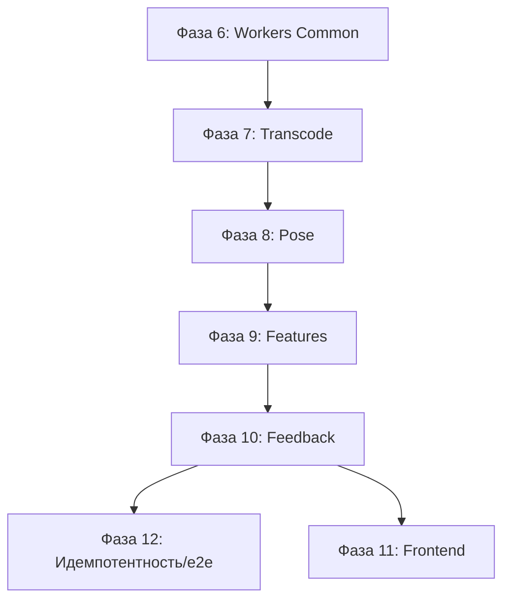

# План развития workers/ (Clean-lite) после фаз 1–5

Ниже — план развития воркеров в контексте уже реализованных фаз 1–5 (инфра, БД, storage, очередь, Clean-lite каркас и API/use cases). План строится вокруг принципа: **воркер — тонкая оболочка**, доменные переходы и постановка задач идут через use cases.

## Базовые принципы для workers/

1. **Тонкие воркеры**: чтение входа → выполнение вычисления → запись артефакта → вызов use case. Никаких прямых переходов статуса.
2. **Use cases определяют переходы**: только `HandleStageCompleted`/`FailAnalysis` решают, какой следующий этап и ставят задачу в очередь.
3. **Порты/адаптеры**: доступ к storage, БД, очереди и inference — через общие адаптеры (повторяемость и тестируемость).
4. **Детерминированные артефакты**: один источник правды — storage + версии (`normalized.mp4`, `keypoints_v1.jsonl`, `features_v1.json`, `feedback_v1.json`).

## Фаза 6: Общие адаптеры и утилиты для воркеров

**Цель:** вынести инфраструктуру из воркеров в `workers/common/` и добиться единообразия I/O.

**Сделать:**
- `workers/common/db.py`: подключение к БД и UnitOfWork для use cases.
- `workers/common/storage.py`: общий клиент storage (локальный/S3) по тем же ключам, что и API.
- `workers/common/queue.py`: клиент очереди/декораторы, единый контракт задач.
- `workers/common/video_io.py`: загрузка/сохранение видео, временные файлы.
- `workers/common/contracts.py`: чтение контрактов модели.
- `workers/common/schemas.py`: валидация артефактов перед сохранением.
- `workers/common/telemetry.py`: логирование/метрики (минимум — контекст job_id/stage).

**Тесты:** unit‑тесты утилит + небольшой smoke‑тест подключения к storage/БД.

## Фаза 7: Transcode Worker (CPU)

**Цель:** нормализация видео → запись `normalized.mp4` → use case.

**Сделать:**
- `workers/cpu/transcode/run.py`:
  - загрузка исходного видео
  - ffmpeg нормализация
  - запись `normalized.mp4`
  - `HandleStageCompleted(stage=TRANSCODE, artifacts=[normalized])`
- ошибки/таймауты → `FailAnalysis(stage=TRANSCODE, reason=...)`

**Тесты:** обработка короткого видео; проверка наличия артефакта и перехода статуса.

## Фаза 8: Pose Worker (GPU) + Triton adapter

**Цель:** inference ключевых точек → `keypoints_v1.jsonl`.

**Сделать:**
- `workers/gpu/pose/triton_client.py` (adapter к Triton через `InferenceClient` порт).
- `workers/gpu/pose/run.py`:
  - чтение `normalized.mp4`
  - батчинг кадров, inference
  - запись `keypoints_v1.jsonl`
  - `HandleStageCompleted(stage=POSE, artifacts=[keypoints])`

**Тесты:** smoke‑тест inference на малом видео.

## Фаза 9: Features Worker (CPU)

**Цель:** вычисление фич → `features_v1.json`.

**Сделать:**
- `workers/cpu/features/run.py`:
  - чтение `keypoints_v1.jsonl`
  - расчёт фич (агрегации, углы)
  - запись `features_v1.json`
  - `HandleStageCompleted(stage=FEATURES, artifacts=[features])`

**Тесты:** проверить валидность схемы артефакта.

## Фаза 10: Feedback Worker (CPU)

**Цель:** rule‑based фидбек → `feedback_v1.json`.

**Сделать:**
- `workers/cpu/feedback/run.py`:
  - чтение `features_v1.json`
  - применение `rules/feedback/v1.yaml`
  - запись `feedback_v1.json`
  - `HandleStageCompleted(stage=FEEDBACK, artifacts=[feedback])`

**Тесты:** локальная проверка правил и JSON schema.

## Фаза 11: Frontend интеграция артефактов

**Цель:** корректное отображение результатов после завершения pipeline.

**Сделать:**
- клиентские компоненты: overlay поз, панель фидбека, видеоплеер.
- API клиент для получения артефактов.

**Тесты:** ручной проход полного сценария.

## Фаза 12: Идемпотентность и эксплуатационные улучшения

**Цель:** устойчивость пайплайна и контроль повторов.

**Сделать:**
- `processed_events` для устранения повторов задач.
- идемпотентность `HandleStageCompleted`/`FailAnalysis`.
- e2e тесты пайплайна (upload → feedback).
- мониторинг очередей, минимальный runbook.

---

## Связь фаз с пайплайном

