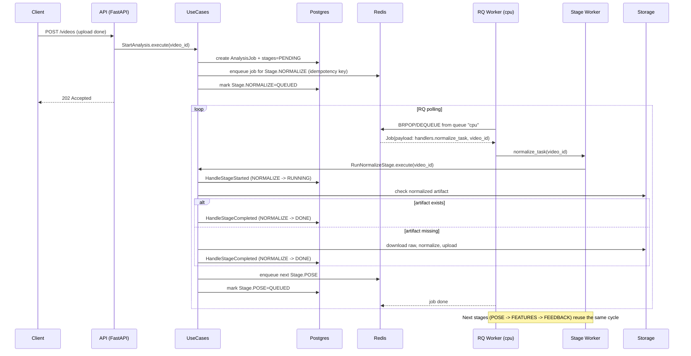

# Queue Processing (RQ)

```mermaid
sequenceDiagram
    participant Client
    participant API as API (FastAPI)
    participant UC as UseCases
    participant DB as Postgres
    participant Redis as Redis
    participant RQ as RQ Worker (cpu)
    participant W as Stage Worker

    Client->>API: POST /videos (upload done)
    API->>UC: StartAnalysis.execute(video_id)
    UC->>DB: create AnalysisJob + stages=PENDING
    UC->>Redis: enqueue job for Stage.NORMALIZE (idempotency key)
    UC->>DB: mark Stage.NORMALIZE=QUEUED
    API-->>Client: 202 Accepted

    loop RQ polling
        RQ->>Redis: BRPOP/DEQUEUE from queue "cpu"
        Redis-->>RQ: Job(payload: handlers.normalize_task, video_id)
        RQ->>W: normalize_task(video_id)
        W->>UC: RunNormalizeStage.execute(video_id)
        UC->>DB: HandleStageStarted (NORMALIZE -> RUNNING)
        UC->>Storage: check normalized artifact
        alt artifact exists
            UC->>DB: HandleStageCompleted (NORMALIZE -> DONE)
        else artifact missing
            UC->>Storage: download raw, normalize, upload
            UC->>DB: HandleStageCompleted (NORMALIZE -> DONE)
        end
        UC->>Redis: enqueue next Stage.POSE
        UC->>DB: mark Stage.POSE=QUEUED
        RQ-->>Redis: job done
    end

    Note over RQ,W: Next stages (POSE -> FEATURES -> FEEDBACK) reuse the same cycle
```
